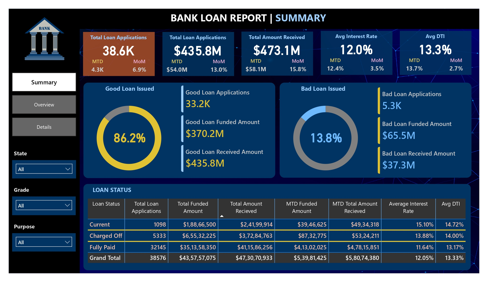
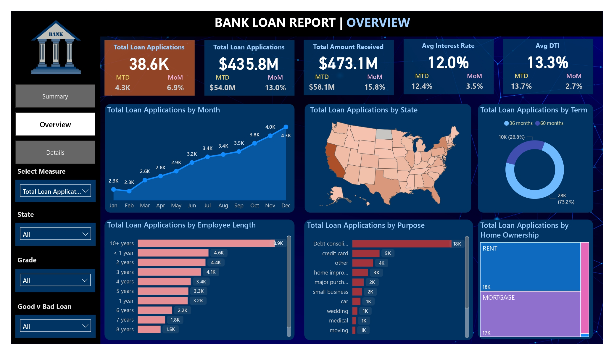
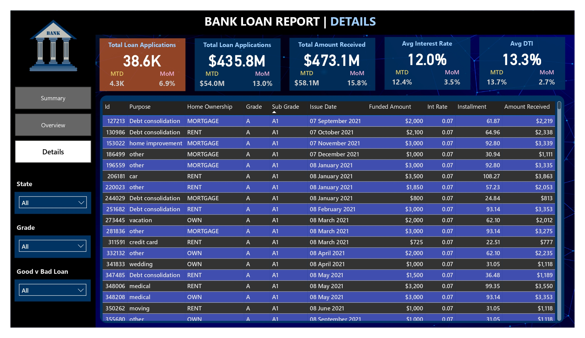

# 📊 Loan Data Analysis Dashboard
# 🧾 Project Overview

This project focuses on analyzing loan data and building an interactive dashboard to track lending performance, borrower behavior, and portfolio health. The dashboard provides actionable insights using key financial metrics and visualizations to support data-driven decision-making.

The solution is designed to help financial institutions monitor loan distribution, identify risk patterns, and improve overall lending strategies.

# 🎯 Objectives
Analyze loan application trends and funding patterns

Monitor repayment performance and cash flow

Identify good vs bad loans

Understand borrower characteristics (income, employment, home ownership)

Provide a detailed and interactive reporting system

# 🛠️ Skills & Tools Used
SQL – Data extraction, transformation, and querying

Power BI – Dashboard creation and data visualization

DAX (Data Analysis Expressions) – KPI calculations and advanced metrics

# 📌 Dashboard Features

1. 📍 Summary Dashboard
   
Total Loan Applications (MTD & MoM tracking)

Total Funded Amount

Total Amount Received

Average Interest Rate

Average Debt-to-Income Ratio (DTI)

Good Loan vs Bad Loan Analysis

Loan Status Overview Grid

2. 📊 Overview Dashboard
    
Monthly Trends (Loan Applications over time)

Regional Analysis (State-wise loan distribution)

Loan Term Distribution

Employment Length Analysis

Loan Purpose Breakdown

Home Ownership Analysis

3. 📋 Detailed Dashboard
   
Complete loan-level dataset view

Borrower-level insights

Drill-down capability for deeper analysis

# 📈 Key Insights

📌 Loan Growth Trend: Loan applications show clear monthly variations, indicating seasonal demand patterns.

📌 Regional Concentration: Certain states contribute significantly to total loan volume, highlighting regional dependency.

📌 Good vs Bad Loans: A majority of loans fall under the “good loan” category, but bad loans still contribute notably to financial risk.

📌 Interest Rate Impact: Higher interest rates are often associated with higher-risk borrowers.

📌 DTI Analysis: Borrowers with higher debt-to-income ratios tend to have a higher probability of default.

📌 Employment Stability: Applicants with longer employment history show better repayment behavior.

📌 Loan Purpose Trends: Debt consolidation and personal loans are among the most common reasons for borrowing.

📌 Home Ownership Factor: Homeowners generally demonstrate more stable repayment patterns compared to renters.

# 💡 Business Value

Enables better risk assessment and loan approval decisions

Helps identify profitable and risky customer segments

Improves monitoring of loan portfolio performance

Supports strategic and data-driven financial planning

📷 Dashboard Preview

🔹 Bank_loan_report_summary_dasboard

🔹 Bank_loan_report_overview_dasboard

🔹 Bank_loan_report_details_dasboard

